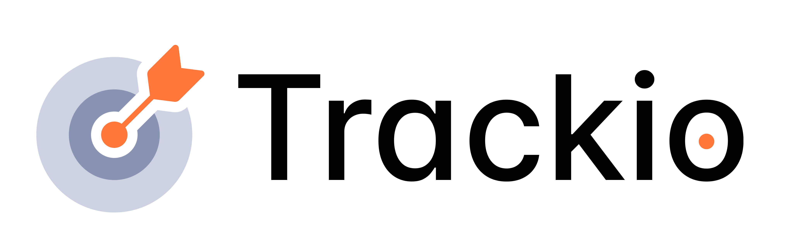

<p align="center">
<picture>
  <source media="(prefers-color-scheme: dark)" srcset="trackio/assets/trackio_logo_type_dark_transparent.png">
  <source media="(prefers-color-scheme: light)" srcset="trackio/assets/trackio_logo_type_light_transparent.png">
  
</picture>
  
</p>


<div align="center">


  
[](https://github.com/gradio-app/trackio/actions/workflows/test.yml)
[](https://pypi.org/project/trackio/)
[](https://pypi.org/project/trackio/)

[](https://twitter.com/trackioapp)

</div>

Welcome to `trackio`: a lightweight, <u>free</u> experiment tracking Python library built by Hugging Face 🤗. It is local-first, supports very high logging throughputs for many parallel experiments, and provides an easy CLI interface for querying, perfect for LLM-driven experimenting.

Trackio also ships with a Gradio-based dashboard you can use to view metrics locally:


Trackio's main features:

- **API compatible** with `wandb.init`, `wandb.log`, and `wandb.finish`. Drop-in replacement: just 

  ```python
  import trackio as wandb
  ```
  and keep your existing logging code.

- **Local-first** design: dashboard runs locally by default. You can also host it on Spaces by specifying a `space_id` in `trackio.init()`.
  - Persists logs in a Sqlite database locally (or, if you provide a `space_id`, in a private Hugging Face Dataset)
  - Visualize experiments with a Gradio dashboard locally (or, if you provide a `space_id`, on Hugging Face Spaces)
- **LLM-friendly**: Built with autonomous ML experiments in mind, Trackio includes a CLI for programmatic access and a Python API for run management, making it easy for LLMs to log metrics and query experiment data.

- Everything here, including hosting on Hugging Face, is **free**!

Trackio is designed to be lightweight and extensible. It is written entirely in Python so that developers can easily fork the repository and add functionality that they care about.

## Installation

Trackio requires [Python 3.10 or higher](https://www.python.org/downloads/). Install with `pip`:

```bash
pip install trackio
```

or with `uv`:

```bash
uv pip install trackio
```

## Usage

To get started, you can run a simple example that logs some fake training metrics:

```python
import trackio
import random
import time

runs = 3
epochs = 8


for run in range(runs):
    trackio.init(
        project="my-project",
        config={"epochs": epochs, "learning_rate": 0.001, "batch_size": 64}
    )

    for epoch in range(epochs):
        train_loss = random.uniform(0.2, 1.0)
        train_acc = random.uniform(0.6, 0.95)

        val_loss = train_loss - random.uniform(0.01, 0.1)
        val_acc = train_acc + random.uniform(0.01, 0.05)

        trackio.log({
            "epoch": epoch,
            "train_loss": train_loss,
            "train_accuracy": train_acc,
            "val_loss": val_loss,
            "val_accuracy": val_acc
        })

        time.sleep(0.2)

trackio.finish()
```

Running the above will print to the terminal instructions on launching the dashboard.

The usage of `trackio` is designed to be identical to `wandb` in most cases, so you can easily switch between the two libraries.

```py
import trackio as wandb
```

## Dashboard

You can launch the dashboard by running in your terminal:

```bash
trackio show
```

or, in Python:

```py
import trackio

trackio.show()
```

You can also provide an optional `project` name as the argument to load a specific project directly:

```bash
trackio show --project "my-project"
```

or, in Python:

```py
import trackio 

trackio.show(project="my-project")
```

## Deploying to Hugging Face Spaces

When calling `trackio.init()`, by default the service will run locally and store project data on the local machine.

But if you pass a `space_id` to `init`, like:

```py
trackio.init(project="my-project", space_id="orgname/space_id")
```

or

```py
trackio.init(project="my-project", space_id="username/space_id")
```

it will use an existing or automatically deploy a new Hugging Face Space as needed. You should be logged in with the `huggingface-cli` locally and your token should have write permissions to create the Space.

## Syncing Offline Projects to Spaces

If you've been tracking experiments locally and want to move them to Hugging Face Spaces for sharing or collaboration, use the `sync` function:

```py
import trackio

trackio.sync(project="my-project", space_id="username/space_id")
```

This uploads your local project database to a new or existing Space. The Space will display all your logged experiments and metrics.

**Example workflow:**

```py
import trackio

# Start tracking locally
trackio.init(project="my-project", config={"lr": 0.001})
trackio.log({"loss": 0.5})
trackio.finish()

# Later, sync to Spaces
trackio.sync(project="my-project", space_id="username/my-experiments")
```

## Embedding a Trackio Dashboard

One of the reasons we created `trackio` was to make it easy to embed live dashboards on websites, blog posts, or anywhere else you can embed a website.


If you are hosting your Trackio dashboard on Spaces, then you can embed the url of that Space as an IFrame. You can even use query parameters to only specific projects and/or metrics, e.g.

```html
<iframe src="https://abidlabs-trackio-1234.hf.space/?project=my-project&metrics=train_loss,train_accuracy&sidebar=hidden" style="width:1600px; height:500px; border:0;">
```

Supported query parameters:

- `project`: (string) Filter the dashboard to show only a specific project
- `metrics`: (comma-separated list) Filter the dashboard to show only specific metrics, e.g. `train_loss,train_accuracy`
- `sidebar`: (string: one of "hidden" or "collapsed"). If "hidden", then the sidebar will not be visible. If "collapsed", the sidebar will be in a collapsed state initially but the user will be able to open it. Otherwise, by default, the sidebar is shown in an open and visible state.
- `footer`: (string: "false"). When set to "false", hides the Gradio footer. By default, the footer is visible.
- `xmin`: (number) Set the initial minimum value for the x-axis limits across all metric plots.
- `xmax`: (number) Set the initial maximum value for the x-axis limits across all metric plots.
- `smoothing`: (number) Set the initial value of the smoothing slider (0-20, where 0 = no smoothing).

## Alerts

Trackio supports alerts that let you flag important events during training. Alerts are printed to the terminal, stored in the database, displayed in the dashboard, and optionally sent to webhooks (Slack, Discord, or any URL).

```python
import trackio

trackio.init(
    project="my-project",
    webhook_url="https://hooks.slack.com/services/T.../B.../xxx",
    webhook_min_level=trackio.AlertLevel.WARN,
)

for epoch in range(100):
    loss = train(...)
    trackio.log({"loss": loss})

    if epoch > 10 and loss > 5.0:
        trackio.alert(
            title="Loss spike",
            text=f"Loss jumped to {loss:.2f} at epoch {epoch}",
            level=trackio.AlertLevel.ERROR,
        )

trackio.finish()
```

You can query alerts via the CLI (`trackio get alerts --project "my-project" --json`), the Python API (`trackio.Api().alerts("my-project")`), or the HTTP endpoint (`/get_alerts`). For full details, see the [Alerts guide](https://huggingface.co/docs/trackio/alerts) and the [ML Agents guide](https://huggingface.co/docs/trackio/ml_agents).

## Examples

To get started and see basic examples of usage, see these files:

- [Basic example of logging metrics locally](https://github.com/gradio-app/trackio/blob/main/examples/fake-training.py)
- [Persisting metrics in a Hugging Face Dataset](https://github.com/gradio-app/trackio/blob/main/examples/persist-dataset.py)
- [Deploying the dashboard to Spaces](https://github.com/gradio-app/trackio/blob/main/examples/deploy-on-spaces.py)

## Throughput & Rate Limits

### Local logging

`trackio.log()` is a non-blocking call that appends to an in-memory queue and returns immediately. A background thread drains the queue every **0.5 s** and writes to the local SQLite database. Because log calls never touch the network or disk on the calling thread, the client-side throughput is effectively **unlimited** -- you can burst thousands of calls per second without slowing down your training loop.

### Logging to a Hugging Face Space

When a `space_id` is provided, the same background thread batches queued entries and pushes them to the Space via the Gradio client API. The main factors that affect end-to-end throughput are:

| Metric | Measured | Notes |
|---|---|---|
| **Burst from a single run** | **2,000 logs delivered in < 8 s** | `log()` calls themselves complete in ~0.01 s; the rest is network drain time. |
| **Parallel runs (32 threads)** | **32,000 logs (32 × 1,000) delivered in ~14 s wall time** | Each thread opens its own Gradio client connection to the Space. |
| **Logs per batch** | No hard cap | All entries queued during the 0.5 s interval are sent in a single `predict()` call. |
| **Data safety** | Zero-loss | If a batch fails to send, it is persisted to local SQLite and retried automatically when the connection recovers. |

These numbers were measured against a free-tier Hugging Face Space (2 vCPU / 16 GB RAM). Throughput will scale with the Space hardware tier, and local-only logging is orders of magnitude faster since no network round-trip is involved.

> **Tip:** For high-frequency logging (e.g. logging every training step), Trackio's queue-and-batch design means your training loop is never blocked by network I/O. Even if the Space is temporarily unreachable, logs accumulate locally and are replayed once the connection is restored.

## Note: Trackio is in Beta (DB Schema May Change)

Note that Trackio is in pre-release right now and we may release breaking changes. In particular, the schema of the Trackio sqlite database may change, which may require migrating or deleting existing database files (located by default at: `~/.cache/huggingface/trackio`).  

Since Trackio is in beta, your feedback is welcome! Please create issues with bug reports or feature requests.

## License

MIT License

## Documentation

The complete documentation and API reference for each version of Trackio can be found at: https://huggingface.co/docs/trackio/index

## Contribute

We welcome contributions to Trackio! Whether you're fixing bugs, adding features, or improving documentation, your contributions help make Trackio better for the entire machine learning community.

<p align="center">
  
</p>

To start contributing, see our [Contributing Guide](CONTRIBUTING.md).

### Development Setup

To set up Trackio for development, clone this repo and run:

```bash
pip install -e ".[dev,tensorboard]"
```

## Pronunciation

Trackio is pronounced TRACK-yo, as in "track yo' experiments"
