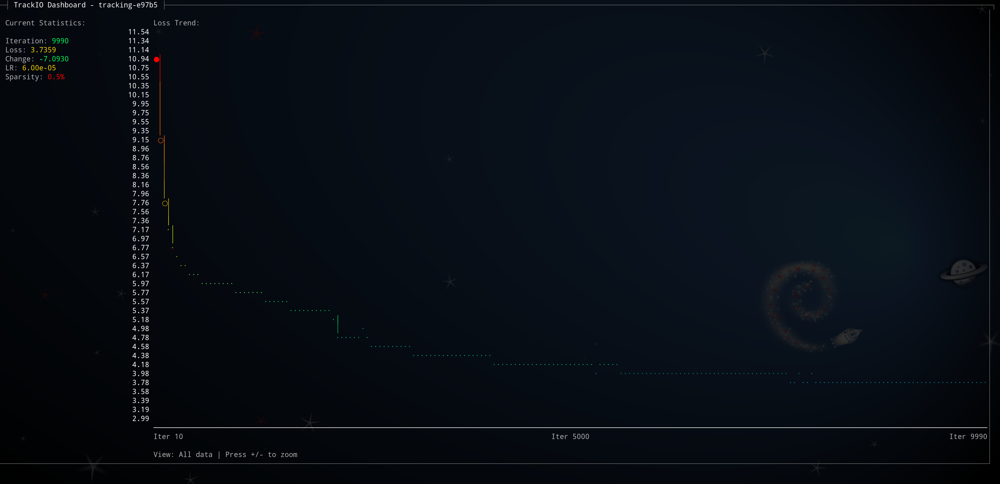
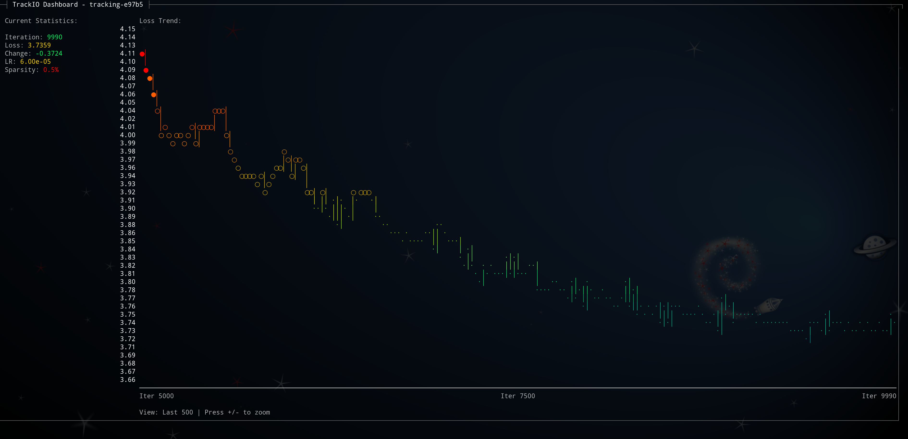
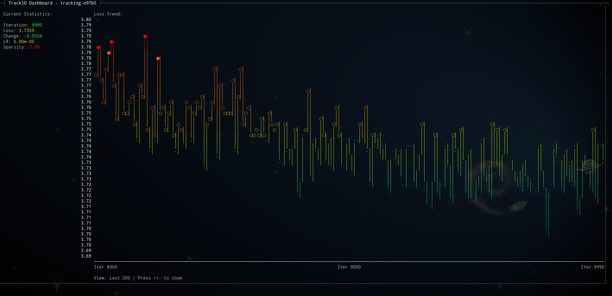
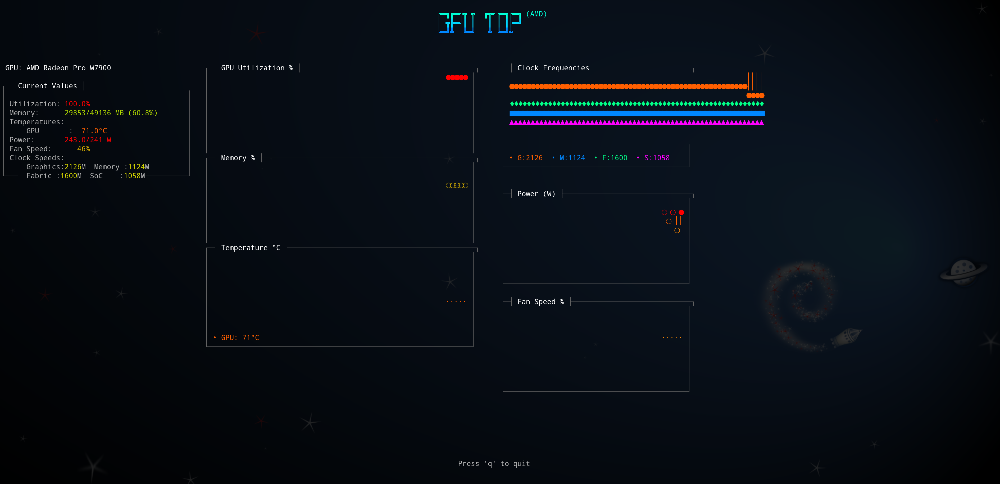

# CLI trackio-view

The `trackio-view` command provides a lightweight, terminal-based dashboard for monitoring TrackIO experiments in real-time. This is perfect for monitoring training progress on remote servers or in terminal-only environments where you don't have access to a web browser.



## Rationale

While the web-based TrackIO dashboard (`trackio show`) provides a rich, interactive experience, there are many scenarios where a terminal-based viewer is more practical:

- **Remote server monitoring**: When training on remote GPU clusters or cloud instances, opening web browsers and port forwarding can be cumbersome
- **Lightweight monitoring**: Terminal UIs consume minimal resources compared to web dashboards
- **SSH-friendly**: Works seamlessly over SSH connections without requiring X11 forwarding or port tunneling
- **Always accessible**: No need to wait for a web server to start or worry about port conflicts
- **Scriptable**: Can be easily integrated into tmux/screen sessions or monitoring scripts

The design is inspired by the [gputop project](https://github.com/mcgrof/gputop), bringing elegant terminal-based monitoring to ML experiment tracking.

## Installation

The `trackio-view` command is included when you install TrackIO:

```bash
pip install trackio
```

For the best experience, also install the optional rich library for enhanced terminal graphics:

```bash
pip install rich
```

## Basic Usage

### Monitor all projects

```bash
trackio-view
```

This will automatically detect and display metrics from all TrackIO projects in your default data location (`~/.cache/huggingface/trackio/`).

### Monitor a specific project

```bash
trackio-view --project my-experiment
```

### Display metrics once (no live updates)

```bash
trackio-view --once
```

### Start with a specific zoom level

```bash
# Start showing only the last 200 iterations
trackio-view --zoom 2

# Display once with zoom to last 100 iterations
trackio-view --once --zoom 3
```

### Adjust update interval

```bash
trackio-view --interval 5  # Update every 5 seconds
```

### View GPU metrics from training database

```bash
trackio-view --gpu-db --project my-experiment --once
```

## Features

### Real-time Metrics Display

The dashboard shows:
- Current step/iteration
- Loss values with color-coding (green for low, yellow for medium, red for high)
- Accuracy metrics (if logged)
- Learning rate
- Custom metrics from your training loop

### ASCII Graphs

Visual representation of metrics over time using ASCII art:
- Loss trend graphs with gradient coloring
- Auto-scaling to fit your data range
- Smooth interpolation between data points

### Color-Coded Feedback

Metrics are color-coded for quick visual feedback:
- **Green**: Good performance (low loss, high accuracy)
- **Yellow**: Medium performance
- **Red**: Poor performance or potential issues
- **Blue/Purple**: Learning rate indicators

### Terminal-Responsive Layout

The dashboard automatically adjusts to your terminal size, ensuring optimal display whether you're using a small SSH window or a full-screen terminal.

### Interactive Zoom Controls

The viewer supports interactive zooming to focus on different portions of your training history:

- **Press `+`** to zoom in (shows more recent iterations)
- **Press `-`** to zoom out (shows more training history)
- **Press `q`** to quit

By default, the graph displays your entire training history. You can progressively zoom in to focus on recent iterations:

#### Default View - All Training Data


#### Zoomed Once - Last 500 Iterations
Press `+` once to zoom in to the last 500 iterations:



#### Zoomed Twice - Last 200 Iterations
Press `+` again to zoom in further to the last 200 iterations:



The zoom levels cycle through:
1. **All data** (default) - Complete training history
2. **Last 500** iterations
3. **Last 200** iterations
4. **Last 100** iterations
5. **Last 50** iterations

The current zoom level is displayed below the graph. This feature is particularly useful for:
- Getting an overview of the entire training progression
- Examining recent training dynamics in detail
- Identifying patterns or anomalies at different scales
- Monitoring convergence behavior

## Example Workflow

### During Training

Start your training script with TrackIO logging:

```python
import trackio

trackio.init(project="my-model-training")

for epoch in range(num_epochs):
    for batch in dataloader:
        loss = train_step(batch)
        trackio.log({"loss": loss, "epoch": epoch})

trackio.finish()
```

In another terminal (or tmux pane), monitor the training:

```bash
trackio-view --project my-model-training
```

### Quick Status Check

Use `--once` to get a quick snapshot of your training metrics without entering live monitoring mode:

```console
$ trackio-view --once
============================================================
TrackIO Dashboard - Project: tracking-e97b5
View: All data
============================================================

Latest Iteration: 9990
Latest Loss: 3.7359
Loss Change: -7.0930 (from 10.8289)
Min Loss: 3.7003
Max Loss: 10.8289
Learning Rate: 6.00e-05
Sparsity: 0.5%

Loss Trend (Iterations 10 to 9990):
  10.83 |*
  10.04 |
   9.24 |
   8.45 |
   7.66 |
   6.87 | **
   6.08 |   ********
   5.28 |           ****
   4.49 |               ***********************************
   3.70 |
        +--------------------------------------------------
```

### Zoomed View for Recent Iterations

Focus on the last 50 iterations to see fine-grained training dynamics:

```console
$ trackio-view --once --zoom 4
============================================================
TrackIO Dashboard - Project: tracking-e97b5
View: Last 50
============================================================

Latest Iteration: 9990
Latest Loss: 3.7359
Loss Change: +0.0157 (from 3.7202)
Min Loss: 3.7003
Max Loss: 3.7484
Learning Rate: 6.00e-05
Sparsity: 0.5%

Loss Trend (Iterations 9500 to 9990):
   3.75 |     * *  *                                 *
   3.74 | *                     *     *       *        **
   3.74 |         * *                  *  *      *        *
   3.73 |   *  *     *  * *      *      *   *     *      *
   3.73 |  *     *    **   * *       *     * *     *
   3.72 |*   *           *  * **  * *    *      *   *
   3.72 |                                             *
   3.71 |                                      *
   3.71 |
   3.70 |                          *
        +--------------------------------------------------
```

Notice how the zoomed view shows:
- More granular loss changes (+0.0157 vs -7.0930)
- Tighter Y-axis range (3.70-3.75 vs 3.70-10.83)
- Specific iteration range (9500-9990 vs 10-9990)

### Remote Monitoring

When training on a remote server:

```bash
# SSH into your server
ssh user@gpu-server

# Quick check of training progress
trackio-view --once

# Or monitor live with initial zoom to recent data
trackio-view --zoom 2

# In a screen/tmux session for persistent monitoring
screen -S monitor
trackio-view --project my-training

# You can now disconnect and reconnect to check progress anytime
```

## GPU Hardware Monitoring

TrackIO View includes comprehensive GPU monitoring capabilities, providing real-time hardware metrics alongside your training metrics. This feature is inspired by [gputop](https://github.com/mcgrof/gputop) and supports all major GPU vendors.



### GPU Monitoring Features

- **Real-time GPU metrics**: Utilization, memory usage, temperature, power consumption
- **Multi-clock frequency tracking**: Graphics, memory, fabric, and SoC clocks
- **Visual graphs**: Dot-and-line style performance graphs with color gradients
- **Multi-GPU support**: Automatic detection and monitoring of multiple GPUs
- **Cross-vendor support**: NVIDIA (desktop & Jetson), AMD, and Intel GPUs
- **Direct hardware access**: Uses GPU driver interfaces (sysfs, NVML) for accurate data

### Basic GPU Monitoring

```bash
# Monitor GPU hardware in real-time
trackio-view --gpu

# Display current GPU status once
trackio-view --gpu --once

# Monitor with custom update interval
trackio-view --gpu --interval 1
```

### GPU Status Output

The `--once` flag provides a clean snapshot of current GPU status:

```console
$ trackio-view --gpu --once
============================================================
GPU Status
============================================================

AMD Radeon Pro W7900
  Utilization: 100.0%
  Memory: 29.2/48.0 GB (60.8%)
  Temperature: 70°C
  Power: 240/241W
  Fan: 48.9% (1938 RPM)
  GPU Clock: 2162 MHz
  Mem Clock: 1124 MHz
  Perf State: auto
```

### Live GPU Dashboard

The live GPU dashboard (`trackio-view --gpu`) provides:

#### Current Status Panel
- GPU name and vendor detection
- Real-time utilization percentage
- Memory usage (used/total GB and percentage)
- Multiple temperature sensors (GPU, memory, hotspot)
- Power consumption with limits
- Fan speed (percentage and RPM)
- Clock frequencies (graphics, memory, fabric, SoC)
- Performance state information

#### Visual Performance Graphs
- **GPU Utilization**: Real-time usage percentage with color gradients
- **Memory Usage**: VRAM consumption over time
- **Temperature**: Multi-sensor temperature tracking
- **Clock Frequencies**: Graphics, memory, fabric, and SoC clock speeds
- **Power Consumption**: Real-time power draw monitoring
- **Fan Speed**: Cooling system performance

#### Interactive Controls
- **Press 'q'**: Quit immediately
- **Press Ctrl+C**: Exit gracefully
- **Number keys (0-9)**: Switch between multiple GPUs
- **Real-time updates**: Configurable refresh interval

### GPU Logging Integration

GPU metrics can be automatically logged to your TrackIO database during training:

```python
import trackio

# Enable automatic GPU logging
trackio.init(project="my-training", log_gpu=True)

for epoch in range(num_epochs):
    for batch in dataloader:
        loss = train_step(batch)
        # GPU metrics automatically logged with each call
        trackio.log({"loss": loss, "epoch": epoch})

trackio.finish()
```

This automatically captures GPU metrics with each log call:
- `gpu/utilization`: GPU usage percentage
- `gpu/memory_used_gb`: VRAM usage in GB
- `gpu/memory_percent`: VRAM usage percentage
- `gpu/temperature_c`: GPU temperature in Celsius
- `gpu/power_w`: Power consumption in watts
- `gpu/clock_graphics_mhz`: Graphics clock frequency
- `gpu/clock_memory_mhz`: Memory clock frequency
- `gpu/clock_fclk_mhz`: Fabric clock frequency (AMD)
- `gpu/clock_socclk_mhz`: SoC clock frequency (AMD)

### Supported GPU Models

TrackIO GPU monitoring has been tested on:

#### NVIDIA GPUs
- **Desktop**: RTX 30/40 series, GTX 10/16 series, Quadro series
- **Datacenter**: A100, V100, A10G, T4
- **Embedded**: Jetson TX2, Xavier, Orin, Nano

#### AMD GPUs
- **Workstation**: Radeon Pro W7900, W6800, W5700
- **Consumer**: RX 6000/7000 series, RX 500/Vega series
- **Datacenter**: MI100, MI250, MI300 series

#### Intel GPUs
- **Arc**: A-series discrete GPUs
- **Integrated**: Iris Xe, UHD Graphics

### GPU Hardware Detection

TrackIO automatically detects GPUs using:

#### NVIDIA Detection
- **NVML library**: Primary method for desktop GPUs
- **Tegrastats**: Jetson embedded systems
- **Sysfs interfaces**: Fallback monitoring

#### AMD Detection
- **Sysfs hwmon**: `/sys/class/drm/card*/device/hwmon/`
- **DRM interfaces**: `/sys/class/drm/card*/device/`
- **Performance states**: `/sys/class/drm/card*/device/pp_dpm_*`

#### Multi-GPU Support
- **Automatic discovery**: Detects any number of GPUs
- **Dynamic switching**: Use number keys to switch between GPUs
- **Vendor mixing**: Supports mixed NVIDIA/AMD/Intel systems
- **Independent monitoring**: Each GPU tracked separately

### Remote GPU Monitoring

Perfect for monitoring training on remote servers:

```bash
# SSH into remote GPU server
ssh user@gpu-cluster

# Quick GPU status check
trackio-view --gpu --once

# Monitor GPU during training
trackio-view --gpu

# In tmux/screen for persistent monitoring
screen -S gpu-monitor
trackio-view --gpu --interval 1
```

### Performance Impact

GPU monitoring is designed to be lightweight:
- **Minimal overhead**: Uses efficient hardware interfaces
- **Configurable updates**: Adjust refresh rate as needed
- **Non-invasive**: Does not affect training performance
- **Background collection**: Optional automatic logging during training

## Command Line Options

```
trackio-view [OPTIONS]

Options:
  -p, --project TEXT     Project name to monitor (shows all if not specified)
  -i, --interval INT     Update interval in seconds (default: 2)
  --once                 Display once and exit (no live monitoring)
  --gpu                  Show live GPU hardware metrics instead of training metrics
  --gpu-db               Show GPU metrics from logged database instead of live hardware (requires --project)
  -z, --zoom {0,1,2,3,4} Initial zoom level (default: 0)
                         0 = All data
                         1 = Last 500 iterations
                         2 = Last 200 iterations
                         3 = Last 100 iterations
                         4 = Last 50 iterations
  -h, --help            Show this help message and exit
```

## Tips and Tricks

1. **Use with tmux/screen**: The terminal UI works great in persistent terminal sessions
2. **Pipe to file**: Use `--once` to capture snapshots: `trackio-view --once > metrics.txt`
3. **Multiple projects**: Leave out `--project` to cycle through all active experiments
4. **Color terminals**: For best results, use a terminal that supports 256 colors or true color

## Troubleshooting

### No data found

If you see "No TrackIO data found", ensure:
- You have run training with TrackIO logging enabled
- The data is stored in the expected location (`~/.cache/huggingface/trackio/`)
- You're specifying the correct project name

### Colors not displaying

Some terminals may not support colors. Try:
- Using a modern terminal emulator (iTerm2, Windows Terminal, etc.)
- Setting `TERM=xterm-256color` in your environment
- Installing the `rich` library for better compatibility

### Performance issues

If the dashboard is slow:
- Increase the update interval with `--interval 10`
- Use `--once` for single snapshots instead of live monitoring
- Check if your TrackIO database has grown very large

## Using --once for Scripts and Automation

The `--once` flag outputs clean text without terminal control codes, perfect for scripting:

### Logging Training Progress

```bash
# Append current metrics to a log file
trackio-view --once >> training_progress.log

# Check metrics every hour and save to timestamped files
while true; do
  trackio-view --once > "metrics_$(date +%Y%m%d_%H%M%S).txt"
  sleep 3600
done
```

### Extract Specific Metrics

```bash
# Get just the current loss value
trackio-view --once | grep "Latest Loss:" | awk '{print $3}'

# Check if training has converged (loss change small)
change=$(trackio-view --once --zoom 3 | grep "Loss Change:" | awk '{print $3}')
if (( $(echo "$change < 0.001 && $change > -0.001" | bc -l) )); then
  echo "Training has converged"
fi
```

### Integration with CI/CD

```bash
# Check if loss is below threshold
trackio-view --project my-model --once | grep "Latest Loss:" | awk '{print $3}' | \
  awk '{if ($1 < 0.5) exit 0; else exit 1}'

# Send metrics to monitoring system
metrics=$(trackio-view --once)
iter=$(echo "$metrics" | grep "Latest Iteration:" | awk '{print $3}')
loss=$(echo "$metrics" | grep "Latest Loss:" | awk '{print $3}')
curl -X POST https://metrics.example.com/api/v1/datapoints \
  -d "series=training.loss&value=$loss&tags=iteration:$iter"
```

## GPU Database Analysis

TrackIO View also supports analyzing GPU metrics that were automatically logged during training sessions. This allows you to review GPU performance patterns from completed experiments.

### Automatic GPU Logging During Training

When training with GPU logging enabled, all GPU metrics are automatically stored in the SQLite database:

```python
import trackio

# Enable automatic GPU logging
trackio.init(project="my-training", log_gpu=True)

for epoch in range(num_epochs):
    for batch in dataloader:
        loss = train_step(batch)
        # GPU metrics automatically logged with each call
        trackio.log({"loss": loss, "epoch": epoch})

trackio.finish()
```

This captures comprehensive GPU metrics alongside your training metrics:
- GPU utilization percentage
- Memory usage (GB and percentage)
- Temperature readings (°C)
- Power consumption (watts)
- Clock frequencies (graphics, memory, fabric, SoC)
- Fan speed and RPM
- Performance state information

### Viewing Stored GPU Metrics

#### Basic GPU Database Analysis

```bash
# View GPU metrics from a specific training run
trackio-view --gpu-db --project my-training --once
```

This displays a comprehensive summary of GPU performance during training:

```console
$ trackio-view --gpu-db --project my-training --once
================================================================================
GPU Metrics from Database - Project: my-training
================================================================================

Latest GPU Status (Step 1000):
  GPU Utilization: 95.2%
  Memory Usage: 22.1 GB (46.0%)
  Temperature: 75°C
  Power: 285W
  Clock Frequencies:
    Graphics: 2100 MHz
    Memory: 1124 MHz
    Fclk: 1600 MHz
    Socclk: 1058 MHz

Historical Data (1001 logged entries):
  GPU Utilization: 85.0% - 100.0% (avg: 94.8%)
  Temperature: 65°C - 82°C (avg: 74°C)
  Power: 200W - 295W (avg: 268W)

Data Range: Steps 0 - 1000

Available GPU Metrics:
  - utilization (1001 data points)
  - memory_used_gb (1001 data points)
  - memory_percent (1001 data points)
  - temperature_c (1001 data points)
  - power_w (1001 data points)
  - clock_graphics_mhz (1001 data points)
  - clock_memory_mhz (1001 data points)
  - clock_fclk_mhz (1001 data points)
  - clock_socclk_mhz (1001 data points)
  - fan_speed (1001 data points)
  - fan_rpm (1001 data points)
  - perf_state (1001 data points)
```

#### Comparing Live vs Stored GPU Data

```bash
# View current live GPU hardware status
trackio-view --gpu --once

# View historical GPU data from training
trackio-view --gpu-db --project my-training --once
```

The key differences:
- **`--gpu`**: Shows real-time hardware status directly from GPU drivers
- **`--gpu-db`**: Shows historical data logged during training sessions

### Use Cases for GPU Database Analysis

#### Performance Optimization

Analyze GPU utilization patterns to optimize training efficiency:

```bash
# Check if GPU was fully utilized during training
trackio-view --gpu-db --project model-v1 --once | grep "GPU Utilization"
```

#### Thermal Analysis

Review temperature trends to ensure thermal stability:

```bash
# Examine temperature ranges across training
trackio-view --gpu-db --project long-training --once | grep "Temperature"
```

#### Power Efficiency Studies

Compare power consumption across different model architectures:

```bash
# Compare power usage between experiments
trackio-view --gpu-db --project efficient-model --once > efficient_gpu.txt
trackio-view --gpu-db --project baseline-model --once > baseline_gpu.txt
diff efficient_gpu.txt baseline_gpu.txt
```

#### Memory Usage Optimization

Track memory consumption patterns:

```bash
# Review memory usage throughout training
trackio-view --gpu-db --project memory-intensive --once | grep "Memory"
```

### Integration with Regular Metrics

GPU database analysis complements regular training metrics analysis:

```bash
# View training progress
trackio-view --project my-training --once

# View GPU performance for the same training run
trackio-view --gpu-db --project my-training --once
```

This dual view allows you to correlate training performance with hardware utilization, helping identify:
- Whether slow training is due to underutilized GPU
- Memory bottlenecks affecting batch sizes
- Thermal throttling impacting performance
- Power limitations during intensive training phases

### Automation and Scripting

The `--once` flag outputs clean text suitable for automated analysis:

```bash
# Extract GPU utilization for automated monitoring
gpu_util=$(trackio-view --gpu-db --project production --once | grep "GPU Utilization:" | awk '{print $3}' | sed 's/%//')

if (( $(echo "$gpu_util < 80" | bc -l) )); then
    echo "Warning: GPU underutilized at ${gpu_util}%"
fi

# Generate GPU performance report
trackio-view --gpu-db --project experiment-batch --once > gpu_report_$(date +%Y%m%d).txt
```

### Live GPU Database Monitoring

For real-time monitoring of GPU metrics during training:

```bash
# Monitor GPU database metrics in real-time
trackio-view --gpu-db --project my-training
```

This provides a live terminal dashboard that updates as new GPU metrics are logged to the database. Features include:

- **Real-time stats**: Latest GPU utilization, memory, temperature, power
- **Historical trends**: Visual graphs showing performance over time
- **Interactive controls**: Press `+`/`-` to zoom, `q` to quit
- **Auto-refresh**: Updates when new data is written to the database
- **Color-coded warnings**: Highlights potential issues (high temps, low utilization)

The live monitoring is particularly useful for:
- Monitoring training progress on remote servers
- Detecting GPU performance issues in real-time
- Correlating GPU metrics with training dynamics
- Ensuring optimal hardware utilization during long training runs

### Limitations

- **Project requirement**: GPU database analysis requires specifying a `--project`
- **Data availability**: Only shows data from training runs that had `log_gpu=True`

## See Also

- [trackio show](launch.md) - Web-based dashboard
- [trackio CLI](manage.md) - Other CLI commands
- [API Reference](api.md) - Python API documentation